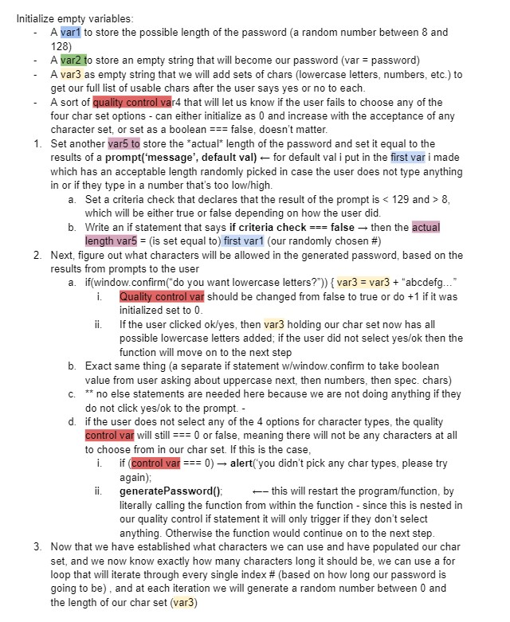
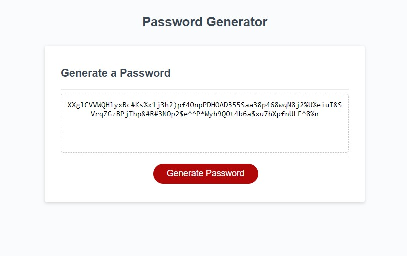

## Password Generator: Module 3 Project (Columbia Bootcamp)
  
# Description
A random, secure password generator that takes input from the user to choose password length between 8-128 characters (and will generate a random # between 1 and 128 if the user does not input correctly). Next, the user will answer window prompts as to whether they want lowercase letters, uppercase letters, numbers, and special characters for the password. The generator will then randomly create a password using only the characters specified. The function includes a safecheck to account for the user not choosing any character type in that the function will be recalled (through recursion) to ask again for the user to select which characters they would like to use.
below is a screenshot of the thought process behind the primary function (generatePassword)

To view the code used for this project, the github repo can be found @ https://github.com/JDR8888/password-generator 

To visit the page and generate a random password  based on your own input, visit the deployed site @ https://jdr8888.github.io/password-generator/

Screenshot of the page below:

# Installation
N/A
# Usage
Generate a secure, completely randomized password including one or all of the following: lowercase and/or uppercase letters, numbers, and special characters. choose a length between 8 and 128 characters or sit back and let the program pick the length for you once you pick which characters to include.

# Credits
giphy.com; forthebadge.com; Columbia U; Elias Spector-Zabusky and Jared Andreassi for proofreading code and comparing ideas. 
# License
Please see the repo for license info